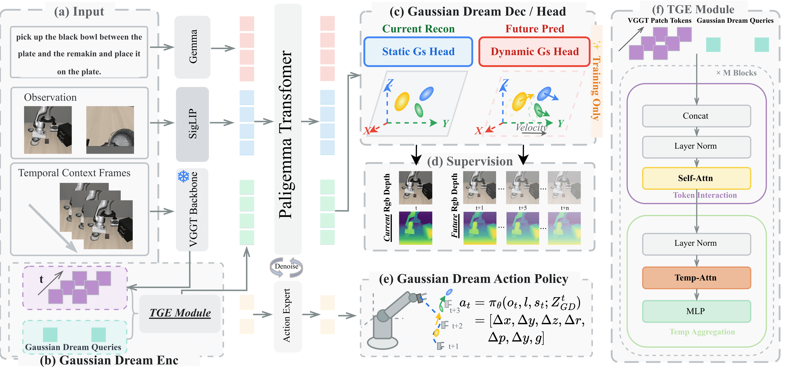

<br>
<p align="center">
  <h1 align="center"><strong>GaussianDream: A Feed-Forward 3D Gaussian World Model for Robotic Manipulation</strong></h1>
  <h3 align="center">🔥 We would appreciate it if you could star GaussianDream ⭐ and share it. Thanks! 🔥</h3>
  <p align="center">
    Zijian Zhang<sup>2,3,1,*</sup>&emsp;
    Yuqing Jiang<sup>2,3,1,*</sup>&emsp;
    Qian Cheng<sup>4</sup>&emsp;
    Xiaofan Li<sup>5</sup>&emsp;
    Si Liu<sup>6</sup>&emsp;
    Ding Zhao<sup>7</sup>&emsp;
    Ping Luo<sup>8</sup>&emsp;
    Weitao Zhou<sup>4</sup>&emsp;
    Haibao Yu<sup>8,1,#</sup>
    <br>
    <sup>1</sup>Tuojing Intelligence&nbsp;&nbsp;
    <sup>2</sup>University of Chinese Academy of Sciences&nbsp;&nbsp;
    <sup>3</sup>Institute of Automation, Chinese Academy of Sciences
    <br>
    <sup>4</sup>Tsinghua University&nbsp;&nbsp;
    <sup>5</sup>Zhejiang University&nbsp;&nbsp;
    <sup>6</sup>Beihang University&nbsp;&nbsp;
    <sup>7</sup>Carnegie Mellon University&nbsp;&nbsp;
    <sup>8</sup>The University of Hong Kong
    <br>
    <sup>*</sup>Equal contribution&nbsp;&nbsp;
    <sup>#</sup>Corresponding author
  </p>
</p>

<p align="center">

[](https://github.com/TuojingAI/GaussianDream)&nbsp;
[](https://arxiv.org/pdf/2605.20752v2)&nbsp;
[](#release-status)

</p>

## Introduction

GaussianDream is a feed-forward 3D Gaussian world model for robotic manipulation. The core implementation lives under the `gaussiandream` Python package, while legacy checkpoint/config identifiers and external asset paths are kept compatible with upstream OpenPI releases.

## Framework

<div align="center">

</div>

## Installation

```bash
git clone https://github.com/TuojingAI/GaussianDream.git
cd GaussianDream
uv sync
```

The package metadata and implementation import namespace are both `gaussiandream`.

Third-party simulators and hardware stacks are not vendored in this repo. Please clone them yourself under `third_party/` before running the corresponding track:

```bash
mkdir -p third_party
git clone https://github.com/Lifelong-Robot-Learning/LIBERO.git third_party/libero
git clone https://github.com/robocasa/robocasa.git third_party/robocasa
git clone https://github.com/ARISE-Initiative/robosuite.git third_party/robosuite
git clone https://github.com/Physical-Intelligence/aloha.git third_party/aloha
```

Optional cache paths:

```bash
export GAUSSIANDREAM_DATA_HOME=<CACHE_DIR>
export CHECKPOINT_DIR=<CHECKPOINT_DIR>
export DATA_ROOT=<DATA_ROOT>
```

`OPENPI_DATA_HOME` is still supported as a fallback for users with existing caches.

## Evaluation tracks

GaussianDream includes three evaluation paths:

- real-robot / runtime clients built around the shared policy server and `gaussiandream-client`
- LIBERO simulation evaluation in `examples/libero/`
- RoboCasa simulation evaluation in `examples/robocasa/`

Start a policy server from a checkpoint:

```bash
uv run scripts/serve_policy.py \
  --port 8010 \
  policy:checkpoint \
  --policy.config gaussiandream_libero \
  --policy.dir <CHECKPOINT_DIR>/<config>/<exp>/<step>
```

For RoboCasa checkpoints, use `--policy.config gaussiandream_robocasa` and a matching checkpoint directory.

### LIBERO

See `examples/libero/README.md` for setup, training, and evaluation commands.

Typical training flow:

```bash
export LIBERO_DATA_WITH_DEPTH_ROOT=<LIBERO_DATA_WITH_DEPTH_ROOT>
export LIBERO_FLOW_ROOT=<LIBERO_FLOW_ROOT>
export GAUSSIANDREAM_PRETRAINED_DIR=<PRETRAINED_MODEL_DIR>

uv run scripts/compute_norm_stats.py --config-name gaussiandream_libero

CUDA_VISIBLE_DEVICES=0 uv run scripts/train_pytorch.py \
  gaussiandream_libero \
  --exp-name gaussiandream_libero_run
```

Typical flow:

```bash
uv run scripts/serve_policy.py --env LIBERO
python examples/libero/main.py --args.task-suite-name libero_10
```

### RoboCasa

See `examples/robocasa/README.md` for conda setup, training, RoboCasa assets, and rollout commands.

Typical training flow:

```bash
export ROBOCASA_H50_ROOT=<ROBOCASA_H50_ROOT>
export GAUSSIANDREAM_PRETRAINED_DIR=<PRETRAINED_MODEL_DIR>

uv run scripts/compute_norm_stats.py --config-name gaussiandream_robocasa

CUDA_VISIBLE_DEVICES=0 uv run scripts/train_pytorch.py \
  gaussiandream_robocasa \
  --exp-name gaussiandream_robocasa_run
```

Typical flow:

```bash
uv run scripts/serve_policy.py \
  --port 8010 \
  policy:checkpoint \
  --policy.config gaussiandream_robocasa \
  --policy.dir <CHECKPOINT_DIR>/<config>/<exp>/<step>

python examples/robocasa/main.py \
  --host 127.0.0.1 \
  --port 8010 \
  --env-name PnPCounterToCab \
  --prompt "pick and place from counter to cabinet"
```

For RoboCasa H50 temporal evaluation, use `examples/robocasa/eval_h50_temporal.py` after installing the RoboCasa client environment.

### Real Robot

See `examples/aloha_real/README.md` for the ALOHA hardware runtime, dataset conversion flow, and training examples.

Typical data pipeline:

```bash
python scripts/run_real_robot_pipeline.py \
  --raw-dir <RAW_PICKLE_DIR> \
  --lerobot-root <LEROBOT_ROOT> \
  --repo-id local/gaussiandream_aloha \
  --config-name gaussiandream_aloha \
  --exp-name gaussiandream_aloha_run
```

Typical serving flow for a trained ALOHA checkpoint:

```bash
uv run scripts/serve_policy.py \
  --env ALOHA \
  --port 8000 \
  policy:checkpoint \
  --policy.config gaussiandream_aloha \
  --policy.dir <ALOHA_CKPT_DIR>/gaussiandream_aloha/<exp>/<step>
```

## Experiments

### Training

GaussianDream currently exposes three main training configs:

- `gaussiandream_libero`: LIBERO simulation training with Gaussian/world-model supervision.
- `gaussiandream_robocasa`: RoboCasa H50 training initialized from the LIBERO PyTorch checkpoint.
- `gaussiandream_aloha`: real-robot / ALOHA fine-tuning on your converted LeRobot dataset.

The common pattern is:

```bash
uv run scripts/compute_norm_stats.py --config-name <config_name>
CUDA_VISIBLE_DEVICES=0 uv run scripts/train_pytorch.py <config_name> --exp-name <run_name>
```

Current environment variables expected by the released configs:

```bash
export GAUSSIANDREAM_PRETRAINED_DIR=<PRETRAINED_MODEL_DIR>
export LIBERO_DATA_WITH_DEPTH_ROOT=<LIBERO_DATA_WITH_DEPTH_ROOT>
export LIBERO_FLOW_ROOT=<LIBERO_FLOW_ROOT>
export ROBOCASA_H50_ROOT=<ROBOCASA_H50_ROOT>
export GAUSSIANDREAM_ALOHA_CKPT_DIR=<ALOHA_CKPT_ROOT>
export GAUSSIANDREAM_ALOHA_CKPT_DIR_TORCH=<ALOHA_CKPT_ROOT_TORCH>
export HF_LEROBOT_HOME=<LEROBOT_ROOT>
```

The released `gaussiandream_robocasa` config currently expects the initialization file
`$GAUSSIANDREAM_PRETRAINED_DIR/pi05_libero.safetensors`, so the recommended order is:

1. train or place the LIBERO PyTorch checkpoint first;
2. fine-tune RoboCasa from that checkpoint;
3. serve the resulting checkpoint with `scripts/serve_policy.py` for evaluation.

## Release status

Checkpoints, datasets, and complete reproduction instructions are coming soon. Large artifacts such as datasets, checkpoints, rendered videos, logs, and experiment outputs are intentionally not tracked in git.

## Contact

If you have any question, please email zijianzhang821@gmail.com.

## Sincere Acknowledgement

Appreciate the following works for their great contributions:

- VGGT: Inspires our 3D-aware visual representation design.
- OpenPI and π0: Serve as the foundation for our policy backbone and codebase.
- 3D Gaussian Splatting: Inspires our 3D Gaussian world modeling design.
- LIBERO and RoboCasa: Serve as the benchmarks for simulation training and evaluation.

## Citation

If you find this work useful in your research, please cite:

```bibtex
@article{zhang2026gaussiandream,
  title={GaussianDream: A Feed-Forward 3D Gaussian World Model for Robotic Manipulation},
  author={Zhang, Zijian and Jiang, Yuqing and Cheng, Qian and Li, Xiaofan and Liu, Si and Zhao, Ding and Luo, Ping and Zhou, Weitao and Yu, Haibao},
  journal={arXiv preprint arXiv:2605.20752},
  year={2026}
}
```
